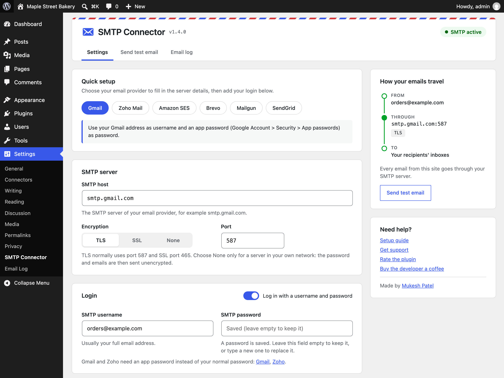

# SMTP Connector

Free and lightweight SMTP plugin for WordPress. It sends every email of the site through your own SMTP server (Gmail, Google Workspace, Zoho, Microsoft 365, Amazon SES, Brevo, Mailgun, SendGrid, Elastic Email…), lets you send a test email, and keeps an email log.

- WordPress.org: https://wordpress.org/plugins/smtp-connector/
- Website: https://mpateldigital.com/smtp-connector/
- Author: [Mukesh Patel](https://mpatel.org/)
- License: GPLv2 or later



`readme.txt` is the WordPress.org readme (plugin directory page). The full version history is in [CHANGELOG.md](CHANGELOG.md).

## Installing from GitHub

Download `smtp-connector.zip` from the [latest release](https://github.com/TheMukeshPatel/smtp-connector/releases/latest) and upload it in **Plugins > Add New Plugin > Upload Plugin**. Don't use GitHub's green "Download ZIP" button: that archive unpacks to `smtp-connector-main/`, so WordPress would install it as a second, separate plugin instead of updating the existing one.

## Requirements

- WordPress 5.9 or newer
- PHP 7.2 or newer
- An SMTP account: host, port, and usually a username and password

## Settings (Settings > SMTP Connector)

| Field | Notes |
| --- | --- |
| Quick setup | One click fills in host, encryption and port for Gmail, Zoho, Amazon SES, Brevo, Mailgun or SendGrid, and shows a provider tip (for example "use an app password"). |
| SMTP host | For example `smtp.gmail.com`. |
| Encryption | TLS (STARTTLS, usually port 587), SSL (usually port 465) or None. Use None only for a server in your own network. |
| SMTP port | Changing the encryption suggests the usual port. A warning appears when port and encryption don't match. |
| Authentication | On by default. Turn it off for relays that accept mail without logging in. |
| SMTP username / password | The password is stored encrypted and is never shown. Leave the field empty to keep the saved password. Gmail and Zoho need an app password. |
| From email / From name | Every email is sent from this address. An empty From name uses the site title. |
| Email log | Turn logging on or off, and choose how many days logs are kept (default 30). |

Until the required SMTP fields are filled in, WordPress keeps sending emails with its default mailer. The settings screen lists what is missing.

The status card next to the form shows how emails travel (From → SMTP server → recipient) and whether SMTP is active, paused (password can't be read) or not set up yet. Below 1100 px wide the card moves above the form.

**Send test email** sends one email through the configured server. If it fails, you see the exact error returned by the SMTP server.

**Reset Settings** removes the server, login and sender settings (including the password). Email log settings and the logs are kept.

## Email log (Settings > Email Log)

- Every email gets one row with recipients, subject, status (Sent / Failed) and, for failures, the SMTP error.
- Click a subject to view the email. HTML emails open in a sandboxed frame: no scripts, no forms, no images from other websites.
- Logs older than the retention period are deleted by a daily WP-Cron event, in batches.
- Logs can contain personal data and password reset links. Only administrators can see them; on multisite, only network administrators.
- The plugin adds suggested text to the privacy policy guide (Settings > Privacy).

## Security

- The SMTP password is encrypted with libsodium `crypto_secretbox` (authenticated encryption). WordPress has bundled libsodium since 5.2.
- The key is derived from `wp_salt('secure_auth')`, which is built from `SECURE_AUTH_KEY` and `SECURE_AUTH_SALT` in `wp-config.php`. These are unique to each site, so a copy of the database alone cannot reveal the password.
- If those keys change (salts regenerated, site moved to a new `wp-config.php`), the saved password can no longer be decrypted. The plugin then:
  - stops sending (no login attempt with a wrong password),
  - shows a warning on the Dashboard, Plugins and settings screens,
  - logs the reason, and waits until the password is entered again.
- Passwords saved by 1.1–1.3.x (AES-256-CBC) are still readable and are converted automatically on update.
- Every form and AJAX action checks the user's capability and a nonce. All output is escaped and all SQL uses prepared statements.

## Multisite

Each site has its own settings, email log table and clean-up event. Network activation works: every site sets itself up on its first page load. Deleting the plugin removes the data of every site.

## Developer hooks

```php
// Seconds to wait while connecting to the SMTP server (default 30).
add_filter( 'smtp_connector_for_wp_smtp_timeout', function () { return 15; } );

// Seconds to wait for each SMTP server reply (default 120).
add_filter( 'smtp_connector_for_wp_smtp_reply_timeout', function () { return 300; } );

// Capability needed to view and clear the email log
// (default 'manage_options', 'manage_network_options' on multisite).
add_filter( 'smtp_connector_for_wp_log_capability', function () { return 'manage_options'; } );
```

Sending results are taken from WordPress core's `wp_mail_succeeded` and `wp_mail_failed` actions, so the plugin works with other code that uses `wp_mail()`.

## Files

```
smtp-connector.php                 Plugin header, sending (phpmailer_init, From filters), password handling, email log writes, clean-up
includes/common.php                Settings, defaults, "is configured" check, install/upgrade (log table schema), shared by uninstall.php
includes/encryption-functions.php  Password encryption/decryption (sodium "sc2:" format + 1.x legacy format)
includes/admin-ui.php              Shared screen parts: header with tabs, status card, help card
includes/settings-page.php         Settings screen, quick setup providers, Send test email, Reset, admin notices, privacy policy text, admin assets
includes/email-log.php             Email log screen, email viewer (AJAX), Clear logs
assets/css/admin.css               Admin styles (plugin screens only)
assets/js/admin.js                 Quick setup, login switch, port suggestion, confirmations, email viewer
uninstall.php                      Removes options, log table and scheduled event (all sites on multisite)
readme.txt                         WordPress.org readme
CHANGELOG.md                       Full version history
```

## Releasing a new version (WordPress.org SVN)

1. Make the changes in `trunk/` only. Never edit existing folders in `tags/`.
2. Update `Version` in `smtp-connector.php`, `SMTP_CONNECTOR_FOR_WP_VERSION`, and `Stable tag` in `readme.txt`. Add the changelog to `readme.txt` and `CHANGELOG.md` (and set the release date).
3. Run the official [Plugin Check](https://wordpress.org/plugins/plugin-check/) plugin: it must report no errors.
4. `svn add` any new files, then copy trunk to the new tag: `svn cp trunk tags/X.Y.Z`.
5. Commit trunk and the tag together: `svn ci -m "Release X.Y.Z" --username themukeshpatel`.
6. Push the same code and changelog to GitHub, create the `vX.Y.Z` tag and release there, and attach `smtp-connector.zip`.

The release zip must contain a single top-level folder named `smtp-connector/` (the WordPress.org slug). WordPress uses that folder name to recognise the plugin: a zip with the files at its root, or with a different folder name, installs as a new plugin instead of replacing the existing one.

```sh
mkdir -p /tmp/build && svn export trunk /tmp/build/smtp-connector
cd /tmp/build && zip -r smtp-connector.zip smtp-connector
```

If the database schema changes, increase `SMTP_CONNECTOR_FOR_WP_DB_VERSION`. Updates don't run activation hooks, so the install routine runs on the first page load after an update.
